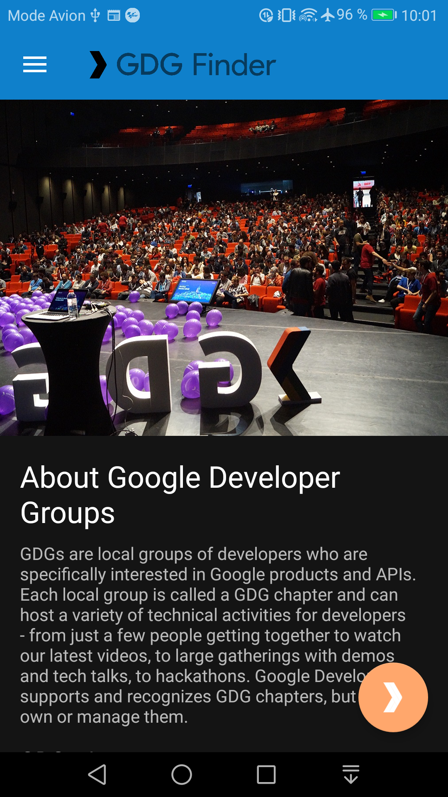
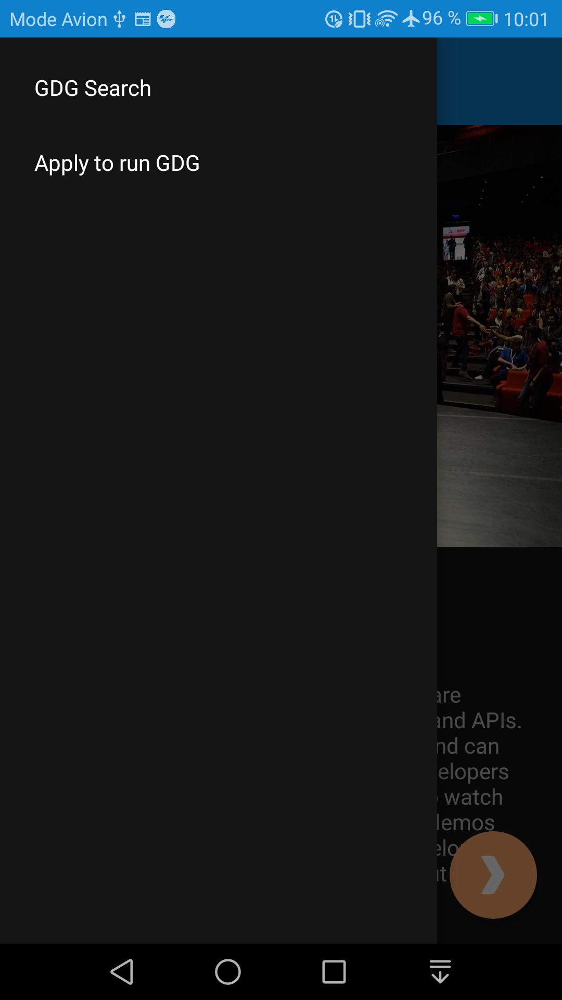
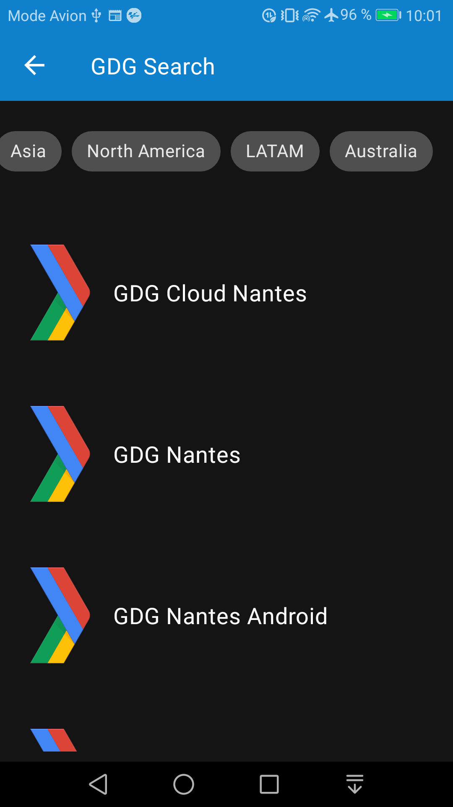

# GdgFinder App

Application permettant de récupérer les GDG worldwide. Il s'agit de la mise en pratique de la lesson 10 ["Designing for everyone"](https://classroom.udacity.com/courses/ud9012/) de Google (Udacity)

## Concepts mis en oeuvres

* Google fonts
* Gestion des styles
* Material Design (FloatingActionButton, Theme attributes, theme overlay)
* Support RTL
* Implémentation des chips
* Implémentation d'un dark theme (DayNight)

## Prérequis

* Android Studio

## Installation

Télécharger le .zip du projet, extraire le contenu dans le répertoire de votre choix et ouvrir ce répertoire dans Android Studio.

## Version SDK

* minSdkVersion 19
* targetSdkVersion 28

## Dépendances

* Kotlin
    org.jetbrains.kotlin:kotlin-stdlib-jdk7:1.3.21
    
* Core with Ktx
    androidx.core:core-ktx:1.0.1

* Constraint Layout
    androidx.constraintlayout:constraintlayout:2.0.0-alpha3

* RecyclerView
    * androidx.recyclerview:recyclerview:1.1.0-alpha03

* ViewModel & LiveData
    * androidx.lifecycle:lifecycle-extensions:2.0.0
    * androidx.lifecycle:lifecycle-viewmodel-ktx:2.1.0-alpha03
    
* Navigation
    * android.arch.navigation:navigation-fragment-ktx:1.0.0
    * android.arch.navigation:navigation-ui-ktx:1.0.0
    
* Moshi
    * com.squareup.moshi:moshi:1.8.0
    * com.squareup.moshi:moshi-kotlin:1.8.0 

* Retrofit
    * com.squareup.retrofit2:retrofit:2.5.0
    * com.squareup.retrofit2:converter-moshi:2.5.0
    
* Coroutines
    * org.jetbrains.kotlinx:kotlinx-coroutines-core:1.1.0
    * org.jetbrains.kotlinx:kotlinx-coroutines-android:1.1.0 

* Retrofit Coroutines Support
    * com.jakewharton.retrofit:retrofit2-kotlin-coroutines-adapter:0.9.2
    
* Glide
    * com.github.bumptech.glide:glide:4.8.0

* Material design components
    * com.google.android.material:material:1.1.0-alpha04

* Client for retrieving location
    * com.google.android.gms:play-services-location:16.0.0
    
## Captures d'écran

